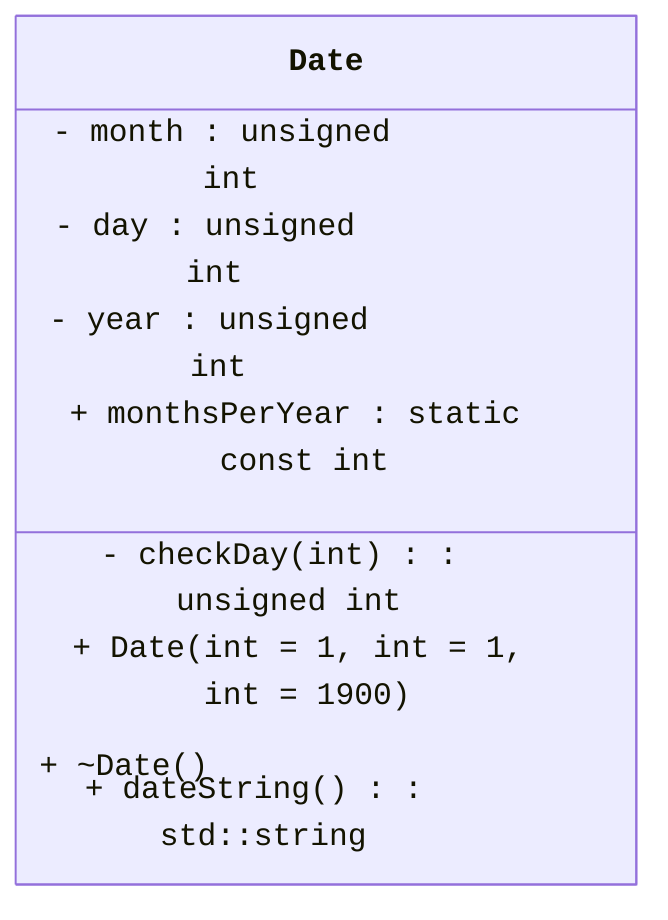
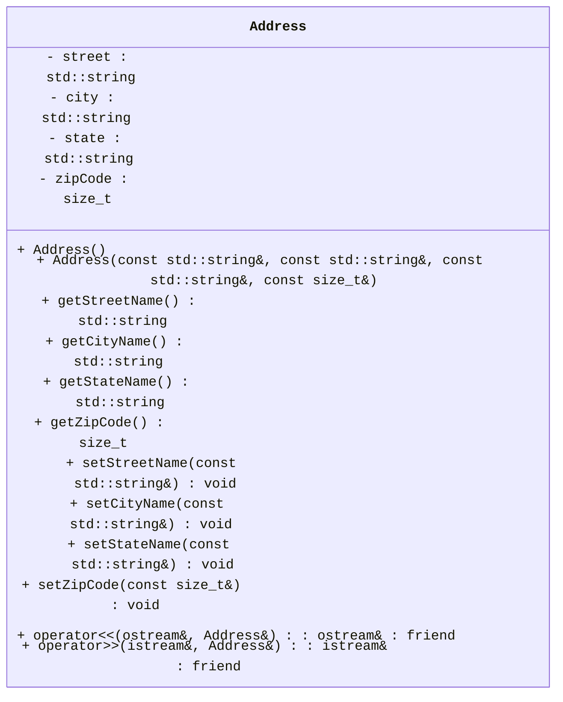
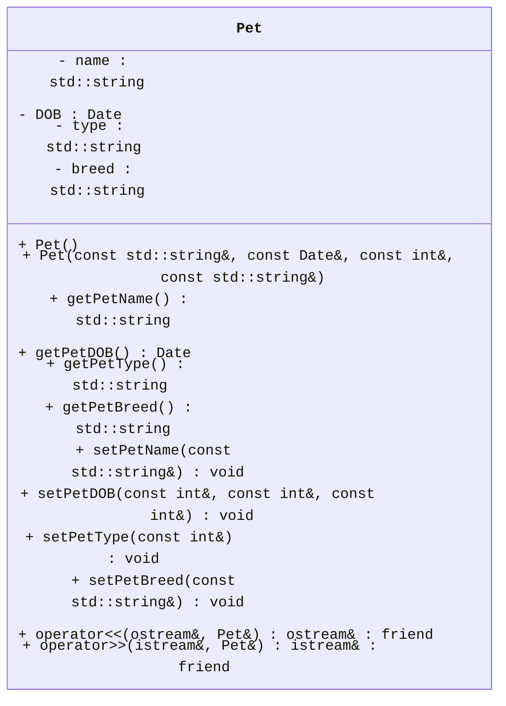
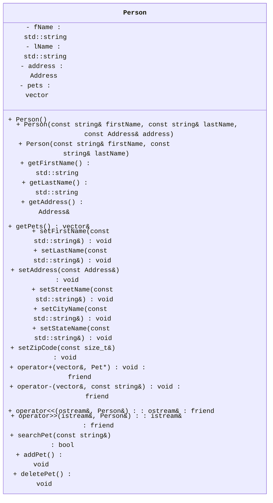

[](https://classroom.github.com/a/L_5laIfE)
[](https://classroom.github.com/open-in-codespaces?assignment_repo_id=18256327)
<link rel="stylesheet" href="https://cdnjs.cloudflare.com/ajax/libs/font-awesome/6.0.0-beta3/css/all.min.css">

# Programming Assignment #6 (PA6)

<!-- [A quick 1-2 sentences talking about the topics and material covered in this assignment] -->

## Overview

<!-- [A high-level summary of what students will be working on in this assignment] -->
In this assignment, we take a look at pointers, classes (Has-A relationship) and operator overloading
<!-- Some details on naming conventions. Some are essential for the Autograder to properly function. -->
<div
    style="background-color: #FFFBEB; border-left: 6px solid #F97316; color: #813F0B; padding: 10px; border-radius: 5px;">
    <i class="fa-solid fa-triangle-exclamation" style="margin-right: 10px;"></i>
    <b style="display: inline; margin-bottom: 8px; font-size: 16px;">Naming Conventions:</b>
    <p><ul>
<li>While implementation details are still up to you, make sure you use the coding style discussed in class regarding functions, name, classes, and indentations unless a specific name is given to you throughout this assignment.</li>
<li>If a specific name for something like a <code>variable</code>, <code>class</code>, or <code>function</code> is given to you, you <em>MUST</em> use it exactly or the autograder won&#39;t be able to find it and the tests will fail.<ul>
<li>This applies to function prototypes/signatures/definitions as well. The <code>inputs</code> and <code>outputs</code> of the functions you implement must also match the ones specified.</li>
<li>Points will <em><em>not</em></em> be given for tests that fail due to incorrect naming or signature mismatch.</li>
</ul>
</li>
<li>Variables should be localized with the correct scope, datatype (based on the data needed to be stored), and their names must be pneumonic. I.e., avoid variables like a, b, i, j, k, x, y, z, etc. </li>
<li>Coding style will be reviewed and your assessment grade may be impacted due to that as described in our syllabus.</li>
<li>Remember that homework must be completed <strong>individually</strong> without help (human or AI).</li>
</ul></p>
</div>

<br>

<!-- Restrictions on what libraries are/aren't allowed to be used -->
<div
    style="background-color: #FEF2F2; border-left: 6px solid #EF4444; color: #991B1B; padding: 16px; border-radius: 5px;">
    <i class="fa-solid fa-fire-flame-curved" style="margin-right: 10px;"></i>
    <b style="display: inline; margin-bottom: 8px; font-size: 16px;">Restrictions:</b>
    <p><ul>
<li>Only the libraries discussed in class can be used in homework:<ul>
<li><code>iostream</code></li>
<li><code>string</code></li>
<li><code>cmath</code></li>
<li><code>random</code></li>
<li><code>ctime</code></li>
<li><code>array</code></li>
<li><code>vector</code></li>
<li><code>cstddef</code></li>
<li><code>iomanip</code></li>
<li><code>exception</code></li>
<li><code>cstdlib</code></li>
<li><code>algorithm</code> (only for transform function)</li>
</ul>
</li>
<li>The <code>using namespace</code> statement such as <code>using namespace std;</code> is <strong>not allowed</strong> in this homework. The <code>using</code> keyword is otherwise allowed, e.g., <code>using std::cout;</code></li>
</ul></p>
</div>

## Tasks & TODOs

<!-- Note (Blue) -->
<div
    style="background-color: #E5F6FF; border-left: 6px solid #2CA5E0; color: #091E42; padding: 16px; border-radius: 5px; font-family: Arial, sans-serif; font-size: 14px;">
    <i class="fa-solid fa-circle-info"></i>
    <b style="display: inline; margin-bottom: 8px; font-size: 16px;">Note:</b>
    <p>There are no TODO comments for this assignment as you are creating your own files. You can use the TODOs from prior PAs as a rough guide to the pieces you need. You should also refer to your class notes and textbook for guidance as necessary.</p>
</div>

<br>

<!-- Warning (Red) -->
<div
    style="background-color: #FEF2F2; border-left: 6px solid #EF4444; color: #991B1B; padding: 16px; border-radius: 5px;">
    <i class="fa-solid fa-fire-flame-curved" style="margin-right: 10px;"></i>
    <b style="display: inline; margin-bottom: 8px; font-size: 16px;">Warning:</b>
    <p>You <strong>must not</strong> implement any inline functions in the header files for this assignment. The autograder is configured to look for all function implementations in the <code>.cpp</code> files. It will not be able to find them if they are in the <code>.h</code> files.</p>
</div>


## Vet's Office

1. In the `src` directory, create `.cpp` and `.h` files for the `Address`, `Pet` and `Person` classes. 
  - the `.h` file must contain only the declaration (prototypes).
    - Your header file should start (other than comments) with the lines:
      - `#ifndef <CLASS_NAME>_H`
      - `#define <CLASS_NAME>_H`
      - If class name is 'Address' then header file will have `#ifndef ADDRESS_H` and `#define ADDRESS_H`.
    - The very last line in the file should be:
      - `#endif`
  - the `.cpp` file must contain the implementation of the class methods.
  - Don't forget everything in C++ is case-sensitive. This includes file names.
    - Files storing Class information should be capitalized as are their classes.
2. The `Date` class:
   - This class is <strong>already implemented</strong>. You <strong>don't have to modify anything</strong> in this class.
   - You will use the constructors of `Date` class to set the date in the `Pet` class.
   - You will use the `dateString` method to get the Date in specific format.
3. The `Address` class:
   - **Member Variables**
     - a `string` that holds the street name - **`street`**
     - a `string` that holds the city name - **`city`**
     - a `string` that holds the state name - **`state`**
     - a `size_t` that holds the zip code - **`zipCode`**
   - **Constructors**
     - a default constructor that takes no parameters.
     - a parameterized constructor that takes values for each member variable in the above order to create an `Address` object.
   - **Member Functions/Methods**
      - Getters & Setters (aka Mutators & Accessors) for each member variable [8 in total].
      - Notice that in setDOB(), you will using parameters to build a new Date object but in the constructor, an existing Date object will be passed.
      - All `string` variables will have values stored in <strong>upper-case</strong> only.
      -  The `operator>>` function takes `istream&` (for `cin`) and `Address&` (for `Address` object ) as parameters and returns `istream&` (for `cin`). It will be declared as a `friend` of `Address` class.
      - The `overloaded >>` operator sets the values for all member variables using user input.
         The Autograder will send inputs in the following sequence. As always, the <> aren't included in the actual inputs. A new line indicates that the enter/return key has been pressed:
         ```
         <STREET>
         <CITY>
         <STATE>
         <ZIPCODE>
         ```
         **Be extra careful managing your input stream!**
      - The `operator<<` function takes `ostream&` (for `cout`) and `Address&` (for `Address` object ) as parameters and returns `ostream&` (for `cout`). The `overloaded <<` operator displays the `Address` object in format specified below.  It will be declared as a `friend` of `Address` class.
         - the output must match the following format exactly! What is between the <> will be your member variables. Do not include the <> characters in your output. Be sure to end each line.
         - The left side of the ':' will be a field of 14 characters, then the colon character ':', then a field of 20 characters for a total of 35 characters.
```
STREET        :            <Street>
CITY          :              <City>
STATE         :             <State>
ZIP CODE      :               <zip>
```
4. The `Pet` class:
   - **Member Variables**
     - a `string` that holds the pet name - **`name`**
     - a `Date` that holds the date of birth - **`DOB`**
     - a `string` that holds the pet type - **`type`**
     - a `string` that holds the breed - **`breed`**
   - **Constructors**
     - a default constructor that takes no parameters.
     - a full parameterized constructor that takes values for each member variable in the above order to create a `Pet` object. Use constructor for `Date` class to set `DOB` 
   - **Member Functions/Methods**
      - Getters & Setters (aka Mutators & Accessors) for each member variable [8 in total].
      - All `string` variables will have values stored in <strong>upper-case</strong> only.
      - `setType` will take a `const int &` as input and sets the `type` using below values (should implement using `switch-case` only).
         - `1` : `DOG`
         - `2` : `CAT`
         - `3` : `BIRD`
         - `4` : `SNAKE`
         - If any other values are passed as input (default), then the type will be specified by user-input.
      - The `operator>>` function takes `istream&` (for `cin`) and `Pet&` (for `Pet` object ) as parameters and returns `istream&` (for `cin`).
      - The `overloaded >>` operator sets the values for all member variables using user input.  It will be declared as a `friend` of `Pet` class.
        The Autograder will send inputs in the following sequence. As always, the <> aren't included in the actual inputs. A new line indicates that the enter/return key has been pressed:
         ```
         <NAME>
         <MONTH>
         <DAY>
         <YEAR>
         <TYPENUM>
         <TYPENAME> // *only* if TYPENUM isn't 1-4!
         <BREED>
         ```
         **Be extra careful managing your input stream!**
       - The `operator<<` function takes `ostream&` (for `cout`) and `Pet&` (for `Pet` object ) as parameters and returns `ostream&` (for `cout`). The `overloaded <<` operator displays the `Pet` object in format specified below.  It will be declared as a `friend` of `Pet` class.
         - the output must match the following format exactly! What is between the <> will be your member variables. Do not include the <> characters in your output. Be sure to end each line.
         - The left side of the ':' will be a field of 14 characters, then the colon character ':', then a field of 20 characters for a total of 35 characters.
         - Use `dateString` function in `Date` class to print the `DOB`.
```
NAME          :              <Name>
DOB           :               <DOB>
TYPE          :              <Type>
BREED         :             <breed>
```

5. The `Person` class:
   - **Member Variables**
     - a `string` that holds the first name - **`fName`**
     - a `string` that holds the last name - **`lName`**
     - a `Address` that holds the address- **`address`**
     - a `vector<Pet*>` that holds the pointers to Pet objects - **`pets`**
   - **Constructors**
     - a default constructor that takes no parameters.
     - a parameterized constructor that takes first name, last name and address as parameters to create a `Person` object.
     - a parameterized constructor that takes first name and last name as parameters to create a `Person` object.
   - **Member Functions/Methods**
      - Getters & Setters (aka Mutators & Accessors) for each member variable [11 in total].
        - Setters will be implemented for each member variable of `Address` class as well.
      - All `string` variables will have values stored in <strong>upper-case</strong> only.
      - The `operator>>` function takes `istream&` (for `cin`) and `Person&` (for `Person` object ) as parameters and returns `istream&` (for `cin`). It will be declared as a `friend` of `Person` class.
        - The `overloaded >>` operator sets the values for first name, last name and address using user input.
          The Autograder will send inputs in the following sequence. As always, the <> aren't included in the actual inputs. A new line indicates that the enter/return key has been pressed:
         ```
         <FNAME>
         <LNAME>
         <STREET>
         <CITY>
         <STATE>
         <ZIPCODE>
         ```
         **Be extra careful managing your input stream!**
      - a `public` function called `searchPet` which takes a `string` as a parameter and returns a `bool` value.
           - The `string` parameter specifies the name of the `Pet` to search for.
           - The function will search the `pets` vector and returns `true` if a `Pet` with the provided name is found. Else, returns `false`.   
      - a `public` function called `addPet` which takes no parameters and returns nothing.
           - The function will create a `Pet` object dynamically.
           - Then the member variables of the `Pet` object will be set through user-input (using the `overloaded >>` operator defined for `Pet` object will be easier).
           - If a `Pet` with same name is not present in the `pets` vector, then the pointer to the updated `Pet` object will be pushed into the `pets` vector using the `overloaded +` operator. Otherwise, throw an exception of type const char* with message: `"Pet with same name already exists."`. In other words, throw the message string by itself without an exception wrapper (like std::invalid_argument).
           - An `overloaded +` operator, which will be a friend of `Person` class, pushes a pointer to `Pet` object into the `pets` vector. The `operator+` function takes `vector<Pet*>` (for `pets` vector) and `Pet*` (for Pet to add) as input and returns nothing.
      - a `public` function called `deletePet` which takes no parameters and returns nothing.
           - The function will ask the user to input the name of the `Pet` to be deleted. user-input should be converted to <strong>upper-case</strong> as all strings will be in upper-case.
           - If a `Pet` with provided name exists in the `pets` vector, then it will be deleted using the `overloaded -` operator. Otherwise, throw an exception of type const char* with message: `"Pet not found."`.
           - An `overloaded -` operator, which will be a friend of `Person` class, deletes a pointer to `Pet` object from the `pets` vector. The `operator-` function takes `vector<Pet*>` (for `pets` vector) and `string` (for pet name) as input and returns nothing.
       - The `operator<<` function takes `ostream&` (for `cout`) and `Person&` (for `Person` object ) as parameters and returns `ostream&` (for `cout`). The `overloaded <<` operator displays the `Person` object in format specified below.  It will be declared as a `friend` of `Person` class.
         - The output must match the following format exactly! What is between the <> will be your member variables. Do not include the <> characters in your output. Be sure to end each line.
         - The left side of the ':' will be a field of 14 characters, then the colon character ':', then a field of 20 characters for a total of 35 characters.
         - `Address` and `Pet` can be displayed using the `overloaded <<` operators implemented for specific classes.
         - All `Pet`s in `pets` vector should be displayed using a for loop, each `Pet` information will be seperated by a newline.
         - THe ADDRESS and PETS LIST lines will also be on a field of 14 and aligned left. Pay special attention to new line spacing as well.
         - <strong>If there are no pets under the person then display 'NONE' under 'PETS LIST' </strong>. 

```
FIRST NAME    :          <FirstName>
LAST NAME     :           <LastName>

ADDRESS      
STREET        :             <Street>
CITY          :               <City>
STATE         :              <State>
ZIP CODE      :                <zip>

PETS LIST    
NAME          :               <Name>
DOB           :                <DOB>
TYPE          :               <Type>
BREED         :              <breed>

NAME          :               <Name>
DOB           :                <DOB>
TYPE          :               <Type>
BREED         :              <breed>
```

<!-- Important (Yellow) -->
<div
    style="background-color: #FEF9C3; border-left: 6px solid #F59E0B; color: #854D0E; padding: 16px;  border-radius: 5px;">
    <i class="fa-solid fa-exclamation" style="margin-right: 10px;"></i>
    <b style="display: inline; margin-bottom: 8px; font-size: 16px;">Important!</b>
    <p>Friend functions must appear above functions that use them in the files where they are implemented. This means that the +/- operators must be overloaded before addPet and deletePet. You will get undefined reference errors if they aren't implemented in the right order since friend functions aren't true member functions in this instance.</p>
</div>

### Below is the **UML** representation of the class `Date`.



### Below is the **UML** representation of the class `Address`.



### Below is the **UML** representation of the class `Pet`.



### Below is the **UML** representation of the class `Person`.


<!-- Note (Blue) -->
<div
    style="background-color: #E5F6FF; border-left: 6px solid #2CA5E0; color: #091E42; padding: 16px; border-radius: 5px; font-family: Arial, sans-serif; font-size: 14px;">
    <i class="fa-solid fa-circle-info"></i>
    <b style="display: inline; margin-bottom: 8px; font-size: 16px;">Note:</b>
    <p>Make sure you put the declarations in the header file and the implementations in the .cpp file!</p>
</div>
<br>

1. Create a `main.cpp` file with an `int main()` and use it to test your code.

<!-- Important (Yellow) -->
<div
    style="background-color: #FEF9C3; border-left: 6px solid #F59E0B; color: #854D0E; padding: 16px;  border-radius: 5px;">
    <i class="fa-solid fa-exclamation" style="margin-right: 10px;"></i>
    <b style="display: inline; margin-bottom: 8px; font-size: 16px;">Important!</b>
    <p>Failure to complete this step may result in a loss of points!</p>
</div>

### Specifications

- The `main.cpp` should have a menu asking if the user wishes to Enter a person, ENter a new pet, modify a pet, Delete a pet.
- To make life easier for your client all letters will be stored in uppercase regardless of how they are entered.
- It is strongly recommended that you make your classes friends.
- <strong> Extra Credit: (10pts) </strong> Add the ability to modify a pet or address. This must be a function outside the classes. It can be a friend function.


### Hint: Converting a string to upper-case

The function `transform` allows for coverting a string to upper-case. You need to include `<algorithm>` library to use `transform`.

For example,

```cpp
string name = "John Doe";
transform(name.begin(), name.end(), name.begin(), toupper);
```

will update `name` as 

```cpp
JOHN DOE
```


## Testing 

Your code will run against unit tests on an Autograder. The Autograder runs on Ubuntu Linux so the unit tests are configured for that OS only. You can run the tests in a Codespace (which uses Ubuntu as well) or on your own Ubuntu environment (if you have one) using the provided `g++` instructions. Remember tests must pass on the Autograder to receive points.

### Compiling

It is expected that you are able to compile and run your own code without relying solely on other tools. This includes the VS Code Debugger's "Play/Run" Button. You should not be using that at all for this assignment. Here is the general format for g++ (you leave out the `[]` characters when actually writing the commands ):

```bash
g++ [relevant setting and flags. These usually start with a '-'] [list of files to link together separated by a space : .cpp, .o, .a etc] -lpthread -o [name of the output file you wish to use]
```

The `g++` build command does use a couple extra settings when compiling with the unit tests. The additional options and what they signify are explained here:


- `[.cpp files, .o files, and .a files]` : Now, list off any .cpp source files, .o object files, and .a static library files that need to be included in the build. For all of these, you must include the relative file path for any files that aren't in your current working directory.
    - You will first list off any `.cpp` files needed by your program to run. In general, if your code uses an `#include "*.h"` statement, you will put the corresponding `.cpp` file here.
    - Then, add the object file for the test(s) you wish to run. Remember you must also include the relative file path if you are in a different working directory from the .o file (for example, `../tests/` if you are in the `src` folder or just `tests/` if you at the root of the repo).
    - Lastly, include the file `gtest_main.a`. This file contains the `main` program needed to launch the unit tests against your code.
        - Remember: A build must include **_exactly one (1)_** main function so you can't include your own main when running the unit tests.

- `-lpthread`: Links the pthread library to the resulting executable. In essence, it ensures that threading functions are available in the resulting binary. The unit tests use multithreading which is why we are including it.

- `-o` : This option lets you specify the name of the file you want `g++` to output the executable code. If a file with that name already exists, *it will be overwritten*. The default output file is `a.out` if you don't include this option.

Here is an example of a build command that could be used for this assignment. In this example, the working directory is `repository root` or top level of the repository:

```bash
g++ src/Address.cpp tests/gtest_main.a tests/addressGetters_test.o -lpthread -o addressGetters_test.exe
```

Modify it as needed to run the tests as you wish. The autograder will also still run on each push to your repo if you prefer to test that way. 

<div
    style="background-color: #FFFBEB; border-left: 6px solid #F97316; color: #813F0B; padding: 16px; border-radius: 5px;">
    <i class="fa-solid fa-triangle-exclamation" style="margin-right: 10px;"></i>
    <b style="display: inline; margin-bottom: 8px; font-size: 16px;">Caution</b>
    <p>Do <b>not</b> attempt to force the unit tests to pass by hardcoding in responses to expected values. Attempts to bypass or "trick" the Autograder are considered academic misconduct and may result in a 0 for the whole assignment.</p>
</div>

## Rubric & Grading

Here is the breakdown of the tests, what they test, and how many marks they are worth.

| Test Name        | Description                                           | Marks |
|------------------|-------------------------------------------------------|------:|
| addressGetters_test      | Uses constructors and checks Address's getters                              |    4 |
| addressSetters_test      | Uses constructors and checks Address's setters                              |    6 |
| addressIstream_test      | Checks if >> is overloaded correctly for Address                             |    6 |
| addressOstream_test      | checks if << is overloaded correctly for Address                              |    4 |
| petGetters_test      | Uses constructors and checks Pets's getters                              |    4 |
| petSetters_test      | Uses constructors and checks Pets's setters                              |    6 |
| petIstream_test | Checks if >> is overloaded correctly for Pet | 6 |
| petOstream_test | Checks if << is overloaded correctly for Pet | 4 |
| personGetters_test | Uses constructors and checks Person's getters | 4 |
| personSetters_test | Uses constructors and checks Person's setters | 6 |
| personIstream_test | Checks if >> is overloaded correctly for Person | 6 |
| personPetSearch_test | Checks if search for Pet in pets works correctly | 4 |
| personPetAdd_test | Checks that Pet is added to pets vector correctly | 6 |
| personPetDelete_test | Checks that Pet is deleted from pets vector correctly | 10 |
| personOstream_test | Checks if << is overloaded correctly for Person | 4 |

<div
    style="background-color: #E5F6FF; border-left: 6px solid #2CA5E0; color: #091E42; padding: 10px; border-radius: 5px;">
    <i class="fa-solid fa-circle-info"></i>
    <b style="display: inline; margin-bottom: 8px; font-size: 16px;">Grading Breakdown & Style Points</b>
    <p>Assignments on Canvas will be recorded out of 100 marks.</p>
    <p>The grading of homework is a combination of completeness and correctness of the outputs and programming style. 
Completeness and correctness (80 marks) will be assessed automatically through testing on GitHub Classroom, 
while instructors and TAs will assess the programming style after the deadline (20 marks).</p>
    <p>Code style will be evaluated using the guidelines shown in the Modules on Canvas.</p>
    <p>This grading will be done manually by the TAs after the deadline.</p>
</div>
<br>
<!-- Important (Yellow) -->
<div
    style="background-color: #FEF9C3; border-left: 6px solid #F59E0B; color: #854D0E; padding: 16px;  border-radius: 5px;">
    <i class="fa-solid fa-exclamation" style="margin-right: 10px;"></i>
    <b style="display: inline; margin-bottom: 8px; font-size: 16px;">Important Note Regarding the Rubric</b>
    <p>This Rubric is a breakdown of the test cases and their points only!</p>
    <p>You must also review the Rubric on the Canvas Assignment for the rest of the grading criteria.</p>
</div>
