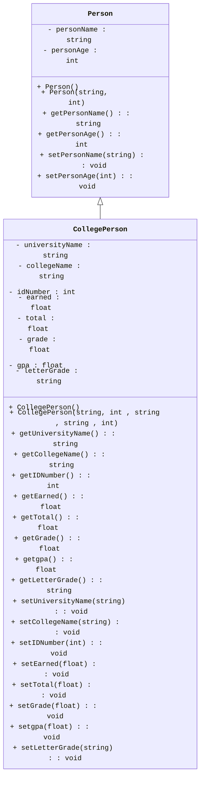

[](https://classroom.github.com/a/IWVj_sPd)
[](https://classroom.github.com/a/S0y9f46Z)
[](https://classroom.github.com/open-in-codespaces?assignment_repo_id=16983913)
<link rel="stylesheet" href="https://cdnjs.cloudflare.com/ajax/libs/font-awesome/6.0.0-beta3/css/all.min.css">

# Programming Assignment #8 (PA8)

## Overview

<!-- [A high-level summary of what students will be working on in this assignment] -->

In this assignment, we will take a look at inheritance relationships,pointers and file reading.

<!-- Some details on naming conventions. Some are essential for the Autograder to properly function. -->
<div
    style="background-color: #FFFBEB; border-left: 6px solid #F97316; color: #813F0B; padding: 10px; border-radius: 5px;">
    <i class="fa-solid fa-triangle-exclamation" style="margin-right: 10px;"></i>
    <b style="display: inline; margin-bottom: 8px; font-size: 16px;">Naming Conventions:</b>
    <p><ul>
<li>While implementation details are still up to you, make sure you use the coding style discussed in class regarding functions, name, classes, and indentations unless a specific name is given to you throughout this assignment.</li>
<li>If a specific name for something like a <code>variable</code>, <code>class</code>, or <code>function</code> is given to you, you <em>MUST</em> use it exactly or the autograder won&#39;t be able to find it and the tests will fail.<ul>
<li>This applies to function prototypes/signatures/definitions as well. The <code>inputs</code> and <code>outputs</code> of the functions you implement must also match the ones specified.</li>
<li>Points will <em><em>not</em></em> be given for tests that fail due to incorrect naming or signature mismatch.</li>
</ul>
</li>
<li>Variables should be localized with the correct scope, datatype (based on the data needed to be stored), and their names must be pneumonic. I.e., avoid variables like a, b, i, j, k, x, y, z, etc. </li>
<li>Coding style will be reviewed and your assessment grade may be impacted due to that as described in our syllabus.</li>
<li>Remember that homework must be completed <strong>individually</strong> without help (human or AI).</li>
</ul></p>
</div>

<br>

<!-- Restrictions on what libraries are/aren't allowed to be used -->
<div
    style="background-color: #FEF2F2; border-left: 6px solid #EF4444; color: #991B1B; padding: 16px; border-radius: 5px;">
    <i class="fa-solid fa-fire-flame-curved" style="margin-right: 10px;"></i>
    <b style="display: inline; margin-bottom: 8px; font-size: 16px;">Restrictions:</b>
    <p><ul>
<li>Only the libraries discussed in class can be used in homework:<ul>
<li><code>string</code></li>
<li><code>array</code></li>
<li><code>vector</code></li>
<li><code>iostream</code></li>
<li><code>iomanip</code></li>
<li><code>fstream</code></li>
<li><code>sstream</code></li>
<li><code>exception</code></li>
</ul>
</li>
<li>The <code>using namespace</code> statement such as <code>using namespace std;</code> is <strong>not allowed</strong> in this homework.</li>
</ul></p>
</div>

## Tasks & TODOs

<!-- Note (Blue) -->
<div
    style="background-color: #E5F6FF; border-left: 6px solid #2CA5E0; color: #091E42; padding: 16px; border-radius: 5px; font-family: Arial, sans-serif; font-size: 14px;">
    <i class="fa-solid fa-circle-info"></i>
    <b style="display: inline; margin-bottom: 8px; font-size: 16px;">Note:</b>
    <p>There are no TODO comments for this assignment as you are creating your own files. You can use the TODOs from prior PAs as a rough guide to the pieces you need. You should also refer to your class notes and textbook for guidance as necessary.</p>
</div>

### Part 1 : Person And CollegePerson

1.In the `src` directory, create `.cpp` and `.h` files for the `Person` and `CollegePerson` classes. 
  - the `.h` file must contain only the declaration (prototypes).
      - Your header file should start (other than comments) with the lines:
      - `#ifndef <CLASS_NAME>_H`
      - `#define <CLASS_NAME>_H`
  - The very last line in the file should be:
      - `#endif`
  - the `.cpp` file must contain the implementation of the class methods.
  - Don't forget everything in C++ is case-sensitive. This includes file names.

2.The `Person` class
  - **Member Variables**
     - `personName`: a `string` that holds the person name
     - `personAge`: an `int` that holds the person age
  - **Constructors**
     - `Person()`: a default constructor that takes no parameters.
     - `Person(string, int)`: a parameterized constructor that takes values for each member variable in the above order
  - **Getters & Setters**
      - Getters & Setters for each member variable [4 in total].

3.The `CollegePerson` class:
  - This class is a `public` derived class of `Person`
  - **Member Variables**
    - `universityName`: a `string` that holds the CollegePerson university
    - `collegName`: a `string` that holds the CollegePerson college, such as "Engineering"
    - `idNumber`: an `int` that holds the CollegePerson ID
    - `earned`: a `float` that holds the total points earned by the CollegePerson
    - `total`: a `float` that holds the full scores of all exams the CollegePerson taken
    - `grade`: a `float` that holds the CollegePerson grade
    - `gpa`: a `float` that holds the CollegePerson gpa
    - `letterGradea`: a`string` that holds the CollegePerson letterGrade
  - **Constructors**
    - `CollegePerson()`: initialize member variables to default values (0 or "" for numbers and strings respectively)
    - `CollegePerson(string, int, string, string, int)`: a parameterized constructor that takes name（string, age(int), university(string), college(string) and id(int) as parameters to create a CollegePerson object.
  - **Getters & Setters**
      - Getters & Setters for each member variable [16 in total].

4.Below is the **UML** representation of the class `Person` and `CollegePerson`.



### Part 2 : Global Functions
1.In the src directory, create `functions.cpp` and `functions.h` files
  - the .h file must contain only the declaration (prototypes).
  - the .cpp file must contain the implementation of the functions.
  - You will utilize the `Person` and `CollegePerson` classes that were defined in Part 1. 
  - You will declare and implement 5 global functions.

2.A text file(`data/data.txt`) with the students’ names and scores for various deliverables is provided. Each score represents the points earned for the particular deliverable. The total points possible are also entered in the file.
  -  The format of the file will be as shown below（same as file data/data.txt).
  -  Notice the field delimiter is the comma, the delimiter for the sub-records (for each student) is the newline, and the delimiter for the main records is a blank line.

```
John Jones,22,UCD,Engineering,813   // name, age, University, College, id
HW1,15/20    // task name, earned points/ full points
HW2,22/25
HW3,18/20
M1,47/50
P1,42/50

Sara Smith,19,Metro State,Engineering,805
HW1,14/20
HW2,17/25
HW3,16/20
M1,42/50
P1,44/50

```
3.Functions in functions
  - void greeting() : 
    - A greeting is displayed on the screen. The greeting info is "Press Enter to Continue" 
    - The user is asked to press a key and enter to continue.
  
  - int recordCount(); 
    - open the file(data/data.txt) and count the number of student records
    - Returns the number of student records in the file(data/data.txt).
    - The student records are separated by an empty line. 
  
  - void getInput(vector<CollegePerson*>); 
    - A vector of college records is created(You don't need to instantiate the CollegePerson in your code) 
    - The data is read from the file(data/data.txt) and used to generate the CollegePerson records. 
    - After that, the CollegePerson's name, age, University, College, id, earned points, and total points will be set.
    - individual grades are not stored, just the running total of points earned and points total possible. 
    - call recordCount() inside may be helpful
    - Hint : use stringstream, str(), clear()

  - void calcGrades(vector<CollegePerson*>);
    - The final Grade is calculated. 
        - Formula : grade = (earned / total) * 100
        - You must to use this formula provided.
    - The final GPA and letter grades are calculated.  
    - The corresponding records in vecter was set correctly. 
    - The GPA standard used is as shown below. 

```
grade              lettergrade  gpa
______________________________________
94 < grade <= 100    A+          4.5
89 < grade <= 94     A           4.0
84 < grade <= 89     B+          3.5
79 < grade <= 84     B           3.0
74 < grade <= 79     C+          2.5
69 < grade <= 74     C           2.0
64 < grade <= 69     D+          1.5
60 < grade <= 64     D           1.0
grade <= 60          F           0
```
  - void display(vector<CollegePerson*>);
    - Output format is as shown below.
      - Group Records by University: Display records grouped by university name (only UCD and Metro State). Use conditional statements (e.g., if statements) for grouping.
      - Separator: Use a horizontal line of 90 hyphens (-) to separate the university name from its respective data.
      - Spacing: Insert a blank line to indicate a change in university.
      - The left side of the each field is 15 characters.
```
UCD
------------------------------------------------------------------------------------------
Name           Age            ID             College        GPA            Grade          
John Jones     22             813            Engineering    3.5            B+             

Metro State
------------------------------------------------------------------------------------------
Name           Age            ID             College        GPA            Grade          
Sara Smith     19             805            Engineering    3              B              
Paul Davis     28             427            Management     0              F              
```

4.Create a `main.cpp` file with an `int main()` and use it to test your code. 

### Specifications
- For part 2, the `main.cpp` should instantiate CollegePerson objects, declare a vector<CollegePerson*>,allocate CollegePerson object according to records count and pushback pointers.(Remember to delete them.)
- You can use the data/data.txt to test your functions (or other datas. But please don't overwrite this file). 

<!-- Important (Yellow) -->
<div
    style="background-color: #FEF9C3; border-left: 6px solid #F59E0B; color: #854D0E; padding: 16px;  border-radius: 5px;">
    <i class="fa-solid fa-exclamation" style="margin-right: 10px;"></i>
    <b style="display: inline; margin-bottom: 8px; font-size: 16px;">Important!</b>
    <p>Failure to complete this step may result in a loss of points!</p>
</div>

## Testing 

Your code will run against unit tests on an Autograder. The Autograder runs on Ubuntu Linux so the unit tests are configured for that OS only. You can run the tests in a Codespace (which uses Ubuntu as well) or on your own Ubuntu environment (if you have one) using the provided `g++` instructions. Remember tests must pass on the Autograder to receive points.

### Compiling

It is expected that you are able to compile and run your own code without relying solely on other tools. This includes the VS Code Debugger's "Play/Run" Button. You should not be using that at all for this assignment. Here is the general format for g++ (you leave out the `[]` characters when actually writing the commands ):

```bash
g++ [relevant setting and flags. These usually start with a '-'] [list of files to link together separated by a space : .cpp, .o, .a etc] -lpthread -o [name of the output file you wish to use]
```

The `g++` build command does use a couple extra settings when compiling with the unit tests. The additional options and what they signify are explained here:


- `[.cpp files, .o files, and .a files]` : Now, list off any .cpp source files, .o object files, and .a static library files that need to be included in the build. For all of these, you must include the relative file path for any files that aren't in your current working directory.
    - You will first list off any `.cpp` files needed by your program to run. In general, if your code uses an `#include "*.h"` statement, you will put the corresponding `.cpp` file here.
    - Then, add the object file for the test(s) you wish to run. Remember you must also include the relative file path if you are in a different working directory from the .o file (for example, `../tests/` if you are in the `src` folder or just `tests/` if you at the root of the repo).
    - Lastly, include the file `gtest_main.a`. This file contains the `main` program needed to launch the unit tests against your code.
        - Remember: A build must include **_exactly one (1)_** main function so you can't include your own main when running the unit tests.

- `-lpthread`: Links the pthread library to the resulting executable. In essence, it ensures that threading functions are available in the resulting binary. The unit tests use multithreading which is why we are including it.

- `-o` : This option lets you specify the name of the file you want `g++` to output the executable code. If a file with that name already exists, *it will be overwritten*. The default output file is `a.out` if you don't include this option.

Here is an example of a build command that could be used for this assignment. In this example, the working directory is `repository root` or top level of the repository:

```bash
g++ -std=c++14 src/Person.cpp src/CollegePerson.cpp src/functions.cpp  tests/gtest_main.a tests/recordCountTest_test.o -lpthread -o recordCountTest_test
```

Modify it as needed to run the tests as you wish. The autograder will also still run on each push to your repo if you prefer to test that way. 
<div
    style="background-color: #FFFBEB; border-left: 6px solid #F97316; color: #813F0B; padding: 16px; border-radius: 5px;">
    <i class="fa-solid fa-triangle-exclamation" style="margin-right: 10px;"></i>
    <b style="display: inline; margin-bottom: 8px; font-size: 16px;">Caution</b>
    <p>Do <b>not</b> attempt to force the unit tests to pass by hardcoding in responses to expected values. Attempts to bypass or "trick" the Autograder are considered academic misconduct and may result in a 0 for the whole assignment.</p>
</div>


## Rubric & Grading

Here is the breakdown of the tests, what they test, and how many marks they are worth.

| Test Name        | Description                                           | Marks |
|------------------|-------------------------------------------------------|------:|
| personConstructorsGettersSettersTest    | Uses constructors, checks Person's getters and setters |    3 |
| collegePersonConstructorsGettersSettersTest  | Uses constructors, and checks CollegePerson's setters and getters  |    6 |
| greetingTest      | check greeting info                 |    4 |
| recordCountTest     | check if recordCount() returns the  correct number of student records in the file  |    10 |
| getInputTest     | check if getInputTest() generates and set CollegePerson record correctly       |   25 |
| calcGradesTest      | check if grade, gpa, letter grade was calculated and set correcttly           |  20 |
| displayTest| Checks display  | 12 |


<div
    style="background-color: #E5F6FF; border-left: 6px solid #2CA5E0; color: #091E42; padding: 10px; border-radius: 5px;">
    <i class="fa-solid fa-circle-info"></i>
    <b style="display: inline; margin-bottom: 8px; font-size: 16px;">Grading Breakdown & Style Points</b>
    <p>Assignments on Canvas will be recorded out of 100 marks.</p>
    <p>The grading of homework is a combination of completeness and correctness of the outputs and programming style. 
Completeness and correctness (80 marks) will be assessed automatically through testing on GitHub Classroom, 
while instructors and TAs will assess the programming style after the deadline (20 marks).</p>
    <p>Code style will be evaluated using the guidelines shown in the Modules on Canvas.</p>
    <p>This grading will be done manually by the TAs after the deadline.</p>
</div>
<br>
<!-- Important (Yellow) -->
<div
    style="background-color: #FEF9C3; border-left: 6px solid #F59E0B; color: #854D0E; padding: 16px;  border-radius: 5px;">
    <i class="fa-solid fa-exclamation" style="margin-right: 10px;"></i>
    <b style="display: inline; margin-bottom: 8px; font-size: 16px;">Important Note Regarding the Rubric</b>
    <p>This Rubric is a breakdown of the test cases and their points only!</p>
    <p>You must also review the Rubric on the Canvas Assignment for the rest of the grading criteria.</p>
</div>

